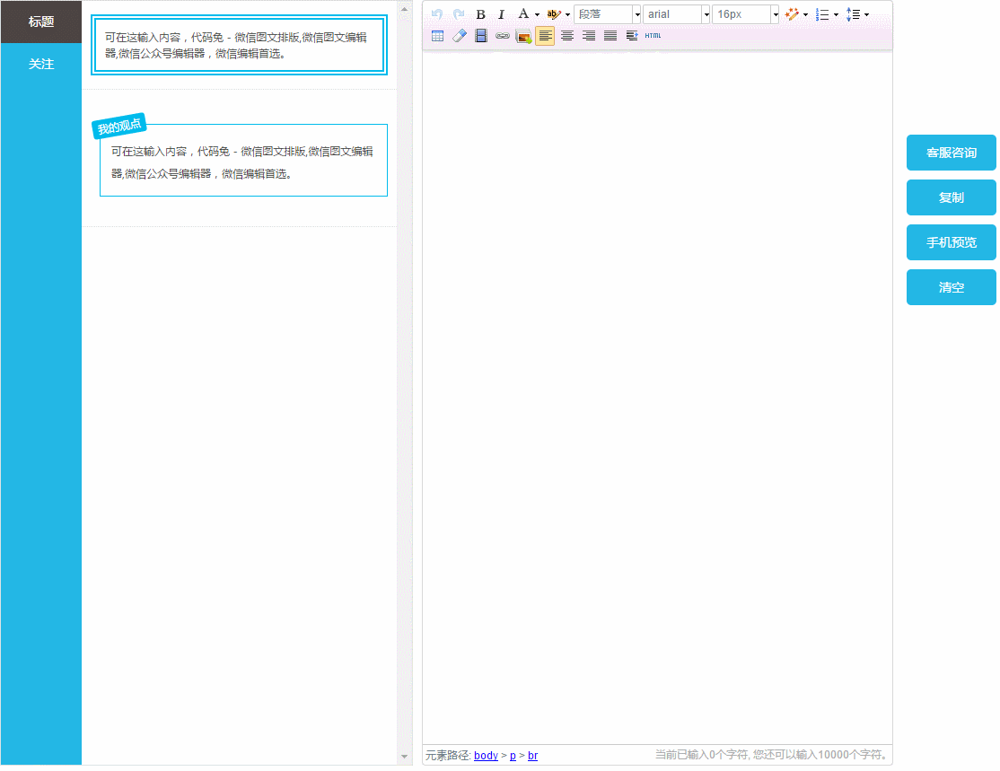
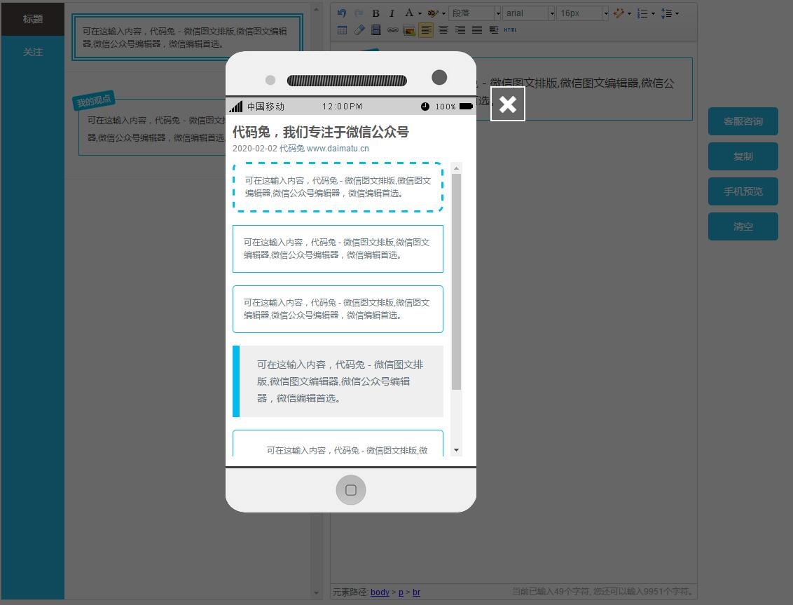
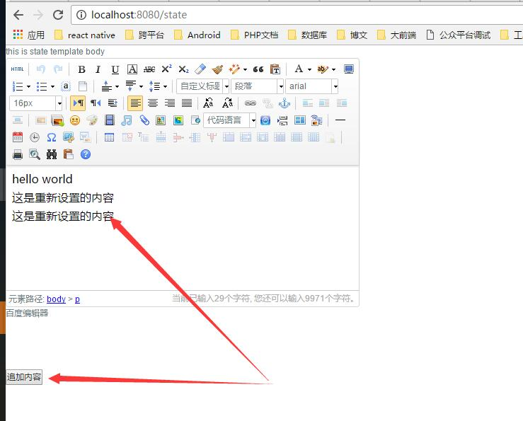
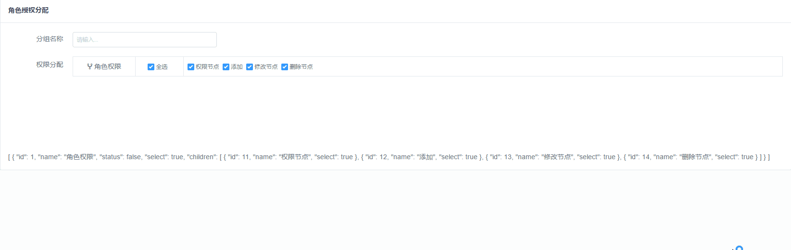
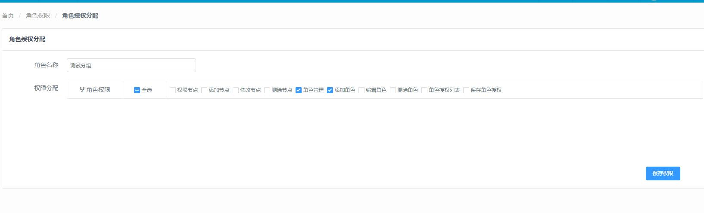
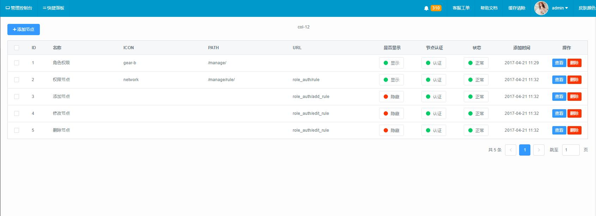
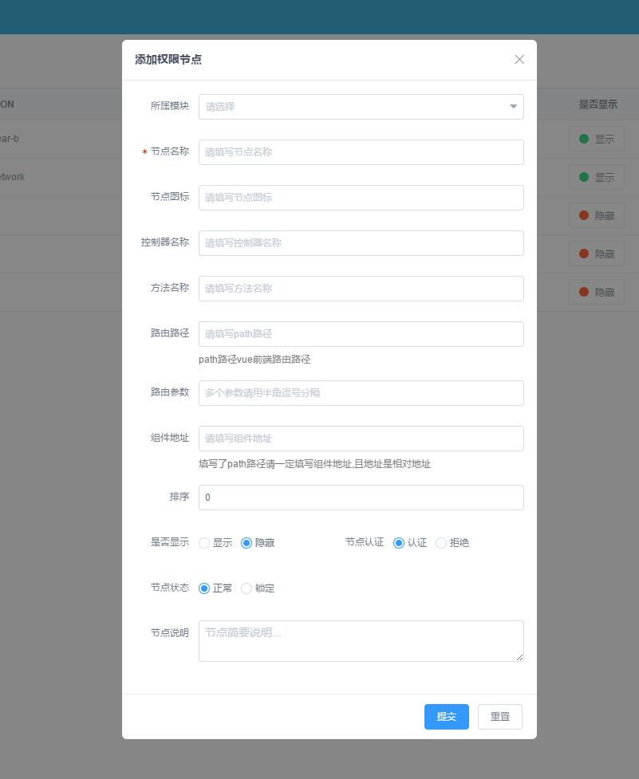
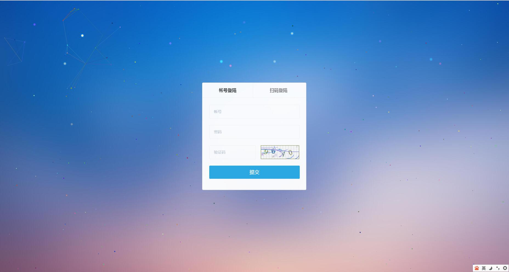

## 介绍
> 本项目是我前面一个项目的新仓库，没有在那边建分支[原项目](https://github.com/myxingke/vueManage).而是在这里新建了仓库，主要一个原因是
在那边写的时候没考虑太多，一个是目录杂乱，还有一个没有考虑项目的多页情况，当初我的想法是后端 商户端分开建两个项目，但是实际当我要这样做的时候
发现共用太多，我这边复制过去，万一改了呢，好像也不合理。所以新建创建做多页项目。

# 关于文档说明，请认真看完！

## 联系
> QQ: 327.56.88 （请把点换成0，验证：瞎想） \
> 微信：
 

### 前台:
   > vue-cli \
   > vue \
   > vue-router \
   > vuex \
   > iview \
   > axios

### 后台:
   > apache \
   > PHP \
   > mysql redis

### API
   > 之前没有提供API 现在我补上了 \
   > 把项目里的 http://www.hphp.cn 替换成 http://api.daimatu.cn 
   > 我后端是没有开启跨域的，只有你们自己 把 config 里的 proxyTable 配置好即可
   
### 帐号
   > 超级管理员帐号：admin 登陆密码：123456 \
   > 测试帐号：test 登陆密码：123456 \
   > 关于验证码(验证码可以不填正确，但必须填) \
   > 请不要随便修改密码。
      
#### 关于跨域
 > 我本地不论访问 http://www.php.cn 还是 http://api.daimatu.cn 都是没有问题的。但有朋友反应无法跨域，我暂时后端开启了跨域，但不定哪天关闭了
 建议装一个跨域插件 把 api.daimatu.cn 规则加进去就可以了。 \
 > 插件地址：https://chrome.google.com/webstore/detail/allow-control-allow-origi/nlfbmbojpeacfghkpbjhddihlkkiljbi
 
#### 数据说明（特别是权限节点添加删除）
 > 为了方便演示，我也不好把这数据的增删改查给屏掉。菜单我没有弄实时的，这个我最后上线才会去弄，由于节点里面有添加组件地址。而组件地址是会影响一个项目的运行的。 所以添加了节点组件后不会立即生效，
 但是退出重新登陆是会生效的，我希望大家添加数据后走的时候把你添加的数据给删除掉。我不希望我经常都去同步数据。 

### 后端实现功能
* 后台登录
    * 用户登录
    * 用户退出

* 角色权限（已完成前后台权限鉴证，还差细化到按钮级的权限）
    * 节点列表
    * 节点添加
    * 节点修改
    * 节点搜索
    * 节点删除
    * 角色列表
    * 角色添加
    * 角色修改
    * 角色搜索
    * 角色授权
    * 后台用户
        * 用户列表
        * 用户搜索
        * 用户添加
        * 用户修改
        * 密码一键重置
    
* 商户管理
    * 商户列表
    * 商户添加
    * 商户搜索
    * 商户详情
    * ~~商户编辑~~
    * ~~商户审核~~
    * 商户用户
    * 商户用户密码重置
    * 商户用户搜索
    
* 微编辑器
    * 素材分类
    * 添加分类
    * 编辑分类
    * 删除分类
    * 素材列表
    * 添加素材
    * 编辑素材
    * 删除素材

* 微信平台管理
    * 公众号列表
    * ~~被举报公众号~~
    
* 财务管理
    * ~~财务数据~~
    * ~~退款记录~~
    
* 反馈记录
    * ~~反馈记录~~
    
* 站点配置
    * ~~站点配置~~
    
* 菜单列表
    * 左侧菜单 全根据后台取出来(2.4 路由有坑) 已完成根据权限获取菜单节点


### 商户端实现功能

### 2.4 路由的坑:
   > 2.4 动态路由无论怎么追加都在通配路由后面导致登陆后取到的路由点击404页面。\
   > 我提的问题 https://github.com/vuejs/vue-router/issues/1341 \
   > 解决方法 先不要安装路由 进入node_modules 单独安装
 ```
 cd node_modules
 git clone https://github.com/vuejs/vue-router.git
 npm install
 npm run build  
 ```
 > 这样就可以完全解决以上问题. \
 > 目前官方没有路由删除掉。等官方下一个版本看是否有删除路由功能。暂时退出我自己把登陆追加进去的路由给删除了。
 
 #### 亲测了打包后动态路由照样可以使用，不用担心路径问题！不用担心路径问题！说两遍。
 
 ### 截图
 
 #### vue 微信编辑器（微信编辑器我并没有上传，这个不打算提交，请删除 router.js 里的 微信编辑器 再进行支行）
 
 
 #### vue 微信编辑器
 
 
 #### vue 百度编辑器
 
 
 #### 非法权限请求
 
 
 #### 角色授权
 
 
 #### 角色授权
 
 
 #### 角色列表
 
 
 #### 节点列表
 
 
 #### 添加节点
 
 
 ##### 登陆页
 
 
 
 ##### 登陆后
 
 
 
## Build Setup

``` bash
# install dependencies
npm install

# serve with hot reload at localhost:8088
npm run dev

# build for production with minification
npm run build

# build for production and view the bundle analyzer report
npm run build --report
```

For detailed explanation on how things work, checkout the [guide](http://vuejs-templates.github.io/webpack/) and [docs for vue-loader](http://vuejs.github.io/vue-loader).
